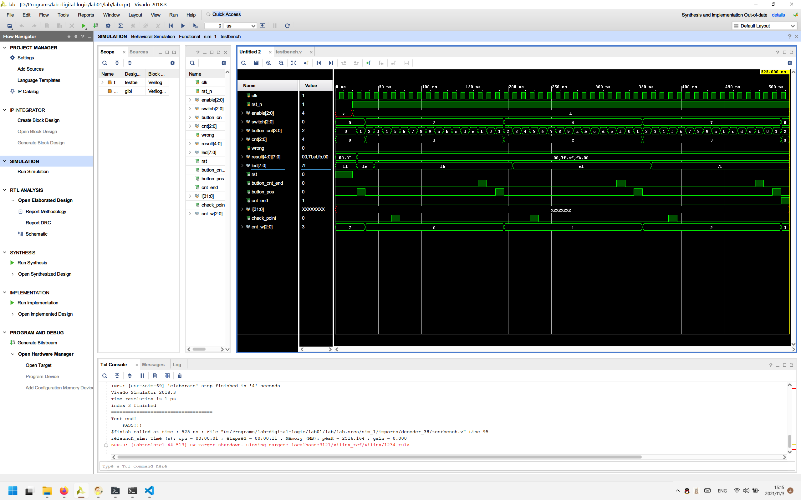
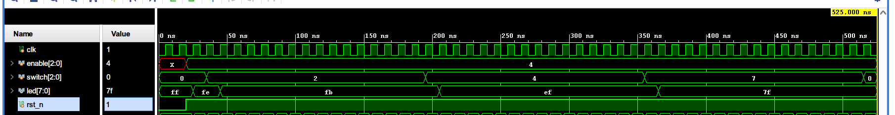
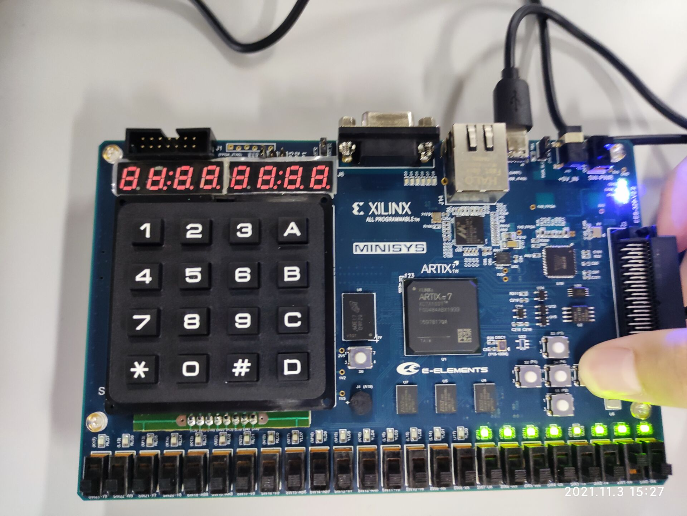
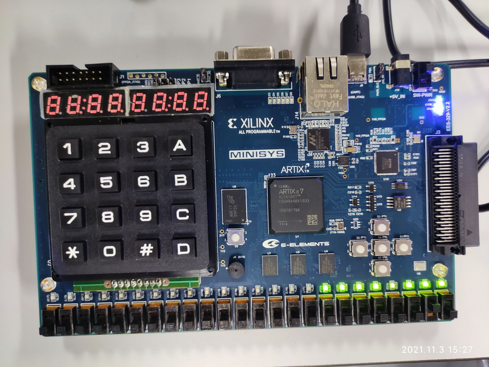
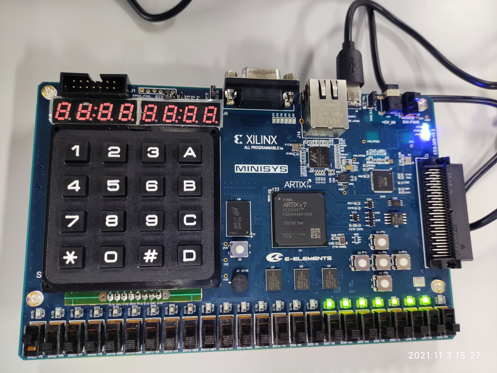

## 数字逻辑实验01：3-8译码器

> 姓名：梁鑫嵘；学号：200110619

### 代码

```verilog
/// Author: Chiro; Date: 2021/11/3
module decoder_38 (input wire clk,
                   input wire rst,
                   input wire [2:0] enable,
                   input wire [2:0] switch,
                   output reg [7:0] led);
    always @ (posedge clk, posedge rst) begin
			if (rst) begin
				led = 8'b1111_1111;
			end else begin
				led = (enable != 3'b100) ? 8'b1111_1111 : (~(8'b0000_0001 << switch));
			end
		end
endmodule

```

### 仿真波形分析

仿真总图：



`decoder_38`模块部分：



分析：

1. 当`rst`为低电平，系统处于复位状态，此时应该使`led = 8'b1111_1111`
2. 当`rst`已经拉高，系统处于运行状态
   1. 如果`enable == 3'd4`，译码器`ENABLE`，应该使`led`的第`switch`位置`0`，其他置`1`
   2. 如果`enable != 3'd4`，则`led`全亮，为`8'b1111_1111`

### 实机照片

1. 系统复位

   

2. 系统运行，但是`enable != 3'd4`

   

3. 系统运行，而且`enable == 3'd4`，`led`灯指示`switch`的状态

   

