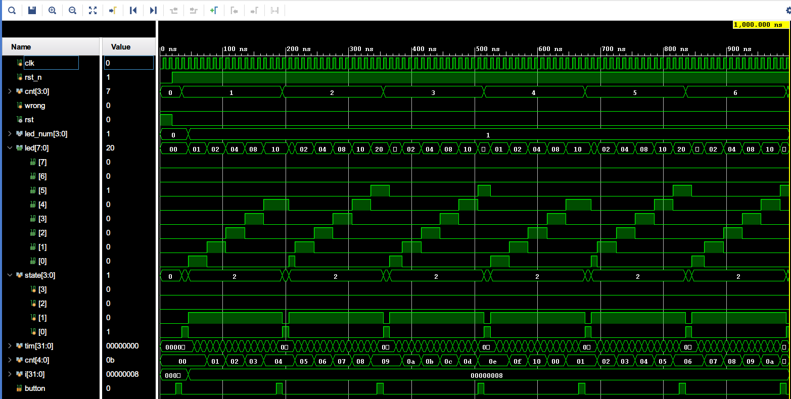
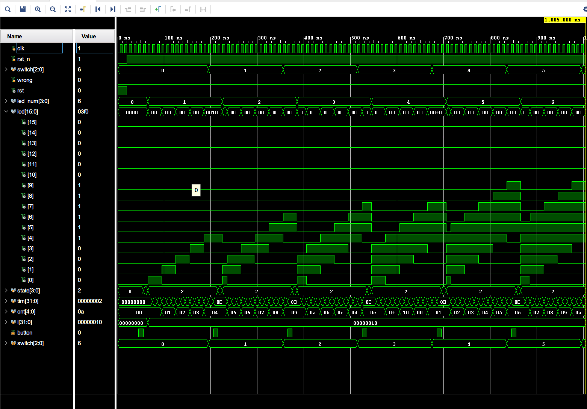
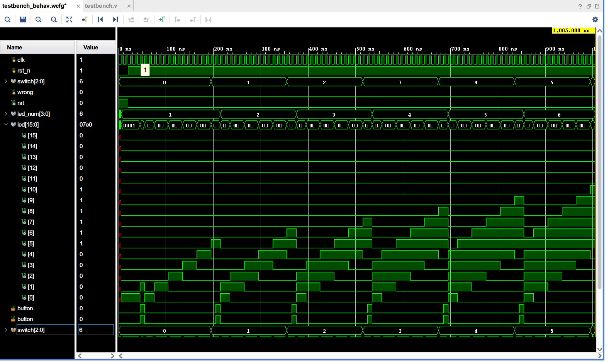
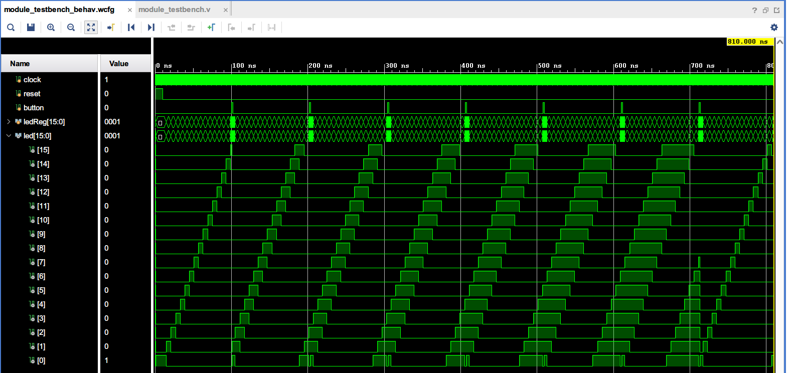

# 实验2

[toc]

> 本实验有`verilog`和`chisel`两个版本的代码，两边都可以正确运行。

## 流水灯

### 代码

```verilog
// Author: Chiro, Date: 2021/11/10
module flowing_water_lights (input wire clk,
                             input wire rst,
                             input wire button,
                             output reg [7:0] led);
	// parameter delay      = 32'd2;
    // 分频数量
    parameter delay      = 32'd100000000;
    parameter STATE_PRE  = 0;
    parameter STATE_INIT = 1;
    parameter STATE_RUN  = 2;
    reg [3:0] state;
    reg [31:0] tim;
    
    always @ (posedge clk or posedge rst) begin
        if (rst) begin
            led   <= 8'b0;
            tim   <= 32'b0;
            // 初始化当前状态机为开始之前
            state <= STATE_PRE;
        end
        else begin
            if (state == STATE_PRE) begin
                // 开始之前状态，等待按键开始，就进入初始化状态
                if (button)
                    state <= STATE_INIT;
            end
            else if (state == STATE_INIT) begin
                // 初始化状态，设置相关信息之后进入运行状态
                led <= 8'b0000_0001;
                state <= STATE_RUN;
            end
            else if (state == STATE_RUN) begin
                // 运行状态，如果有按键就重新初始化
                if (button)
                    state <= STATE_INIT;
                else begin
                    // 计数器溢出，更新
                    if (tim == delay) begin
                        tim <= 32'b0;
                        // 进行一个位的移
                        led <= {led[6-:7], led[7]};
                    end else
                        // 计数
                        tim <= tim + 32'b1;
                end
            end
        end
    end
endmodule

```

### 波形分析



`flow_water_lights`模块完成的是流水灯的功能，在根据时间进行灯的流水变化的同时还要考虑按键复位的功能。

1. 当`rst`拉高，系统复位
2. 当`rst`拉低，系统开始运行
3. 每隔2个时钟周期，`tim`自增1；当`tim`达到`delay`表示`tim`计时完成，需要更新`cnt`再复位`tim`
4. `cnt`更新同时，`led`位移一位
5. 同时，当`button`按下，位移复位，重新从第一位开始流水，`state`变化为：`STATE_RUN -> STATE_INIT -> STATE_RUN`

##  节日彩灯

### 代码

```verilog
// Author: Chiro, Date: 2021/11/10
module holiday_lights (input wire clk,
                       input wire rst,
                       input wire button,
                       input wire [2:0] switch,
                       output reg [15:0] led);
    // 分频数量
    // parameter delay      = 32'd2;
    parameter delay      = 32'd100000000;
    parameter STATE_PRE  = 0;
    parameter STATE_INIT = 1;
    parameter STATE_RUN  = 2;
    reg [3:0] state;
    reg [31:0] tim;
    integer i;
    
    always @ (posedge clk or posedge rst) begin
        if (rst) begin
            led   <= 16'b0;
            tim   <= 32'b0;
            i     <= 0;
            // 初始化当前状态机为开始之前
            state <= STATE_PRE;
        end
        else begin
            if (state == STATE_PRE) begin
                // 开始之前状态，等待按键开始，就进入初始化状态
                if (button)
                    state <= STATE_INIT;
            end
            else if (state == STATE_INIT) begin
                // 初始化状态，设置相关信息之后进入运行状态
                for (i = 0; i < 16; i = i + 1)
                    led[i] = (i < switch + 1) ? 1'b1 : 1'b0;
                state <= STATE_RUN;
            end
            else if (state == STATE_RUN) begin
                // 运行状态，如果有按键就重新初始化
                if (button)
                    state <= STATE_INIT;
                else begin
                    // 计数器溢出，更新
                    if (tim == delay) begin
                        tim <= 32'b0;
                        // 进行一个位的移
                        led <= {led[14-:15], led[15]};
                    end else
                        // 计数
                        tim <= tim + 32'b1;
                end
            end
        end
    end
endmodule
```

### 波形分析



`holiday_lights`模块完成的是流水灯的功能，在根据时间进行灯的流水变化的同时还要考虑按键复位的功能。

1. 当`rst`拉高，系统复位
2. 当`rst`拉低，系统开始运行，`state = STATE_PRE`，等待`button`按下
3. 每隔2个时钟周期，`tim`自增1；当`tim`达到`delay`表示`tim`计时完成，需要更新`cnt`再复位`tim`
4. `cnt`更新同时，`led`位移一位
5. 同时，当`button`按下，位移复位，重新从第一位开始流水，`state`变化为：`STATE_RUN -> STATE_INIT -> STATE_RUN`

## Chisel

### 节日彩灯（流水灯）

当`ledCount=0`的时候其实就是流水灯啦。

### 逻辑部分

```scala
package test 
import chisel3._
import chisel3.util._
import chisel3.experimental._
 
@chiselName
class FlowLights(ledWidth: Int = 8, delay: Int = 100000000, useSwitch: Boolean = false) extends Module {
  val io = IO(new Bundle {
    val button = Input(UInt(1.W))
    val ledCount = if (useSwitch) Some(Input(UInt(3.W))) else None
    val led = Output(UInt(ledWidth.W))
  })

  val ledReg = RegInit(1.U(ledWidth.W))
  val clkReg = RegInit(1.U(32.W))

  def flow(old: UInt) = {
    val bools = old.asBools
    val newUInt = Cat((bools(ledWidth - 1) +: bools.slice(0, ledWidth - 1)).reverse).asUInt
    newUInt
  }

  def generate(count: UInt) = {
    val res = (for { a <- 0 until ledWidth } yield Mux(a.U < count, 1.U, 0.U) << a).reduce(_ | _)
    // printf(p"res = ${Binary(res)}\n")
    res
  }

  when(io.button === 1.U) {
    ledReg := generate(if (useSwitch) (io.ledCount.get + 1.U) else 1.U)
    // printf(p"generated: ${Binary(ledReg)}\n")
    clkReg := delay.U(32.W)
  } .otherwise {
    ledReg := Mux(clkReg === 0.U, flow(ledReg), ledReg)
    clkReg := Mux(clkReg === delay.U, 0.U, clkReg + 1.U)
  }
  io.led := ledReg
}

@chiselName
class FlowLightsWrapper(ledWidth: Int = 16, delay: Int = 2, useSwitch: Boolean = true) extends Module {
  val io = IO(new Bundle {
    val button = Input(UInt(1.W))
    val ledCount = if (useSwitch) Some(Input(UInt(3.W))) else None
    val led = Output(UInt(ledWidth.W))
  })

  val flowLights = Module(new FlowLights(delay=delay, ledWidth=ledWidth, useSwitch=useSwitch))

  flowLights.io.button := io.button
  io.led := flowLights.io.led
  if (useSwitch)
    flowLights.io.ledCount.get := io.ledCount.get
}
```

### 测试部分 & 生成部分

```scala
package test
import org.scalatest._
import chiseltest._
import chisel3._

class FlowLightsTest extends FlatSpec with ChiselScalatestTester with Matchers {
  behavior of "FlowLightsWrapper"
  it should "pass the test" in {
    test(new FlowLightsWrapper(ledWidth=16, delay=4, useSwitch=true)) { c =>
      println("Starting test FlowLights...")
      val ledCount = 0
      c.io.button.poke(1.U)
      c.io.ledCount.get.poke(ledCount.U)
      c.clock.step(2)
      c.io.led.expect((ledCount + 1).U)
      // printf(s"c.io.led: ${c.io.led.peek()}\n")

      c.io.button.poke(0.U)
      c.clock.step()
      c.io.led.expect((ledCount + 1).U)
      c.clock.step()
      c.clock.step()
      c.clock.step()
      c.clock.step()
      c.io.led.expect(((ledCount + 1) << 1).U)
      // c.io.led.expect(ledCount.U << 1.U)
      // c.io.led.expect(((1 << ledCount) - 1).U)
      println("test done.")
    }
  }
}
```

```scala
package test
import chisel3.stage.{ChiselStage, ChiselGeneratorAnnotation}

object testFlowLights extends App {
  (new chisel3.stage.ChiselStage).execute(args, Seq(ChiselGeneratorAnnotation(() => new FlowLightsWrapper(
    delay=2, ledWidth=16, useSwitch=true
  ))))
}
```

### 生成的Verilog代码

~经过外部再添加一个wrapper才能用本实验的testbench。~

```verilog
// Author: Chiro, Date: 2021/11/10

module FlowLights(
  input         clock,
  input         reset,
  input         io_button,
  input  [2:0]  io_ledCount,
  output [15:0] io_led
);
`ifdef RANDOMIZE_REG_INIT
  reg [31:0] _RAND_0;
  reg [31:0] _RAND_1;
`endif // RANDOMIZE_REG_INIT
  reg [15:0] ledReg; // @[flowLights.scala 15:23]
  reg [31:0] clkReg; // @[flowLights.scala 16:23]
  wire [2:0] _ledReg_T_1 = io_ledCount + 3'h1; // @[flowLights.scala 31:56]
  wire [1:0] _ledReg_res_T_5 = {3'h1 < _ledReg_T_1, 1'h0}; // @[flowLights.scala 25:79]
  wire [2:0] _ledReg_res_T_8 = {3'h2 < _ledReg_T_1, 2'h0}; // @[flowLights.scala 25:79]
  wire [3:0] _ledReg_res_T_11 = {3'h3 < _ledReg_T_1, 3'h0}; // @[flowLights.scala 25:79]
  wire [4:0] _ledReg_res_T_14 = {3'h4 < _ledReg_T_1, 4'h0}; // @[flowLights.scala 25:79]
  wire [5:0] _ledReg_res_T_17 = {3'h5 < _ledReg_T_1, 5'h0}; // @[flowLights.scala 25:79]
  wire [6:0] _ledReg_res_T_20 = {3'h6 < _ledReg_T_1, 6'h0}; // @[flowLights.scala 25:79]
  wire [1:0] _GEN_2 = {{1'd0}, 3'h0 < _ledReg_T_1}; // @[flowLights.scala 25:94]
  wire [1:0] _ledReg_res_T_48 = _GEN_2 | _ledReg_res_T_5; // @[flowLights.scala 25:94]
  wire [2:0] _GEN_3 = {{1'd0}, _ledReg_res_T_48}; // @[flowLights.scala 25:94]
  wire [2:0] _ledReg_res_T_49 = _GEN_3 | _ledReg_res_T_8; // @[flowLights.scala 25:94]
  wire [3:0] _GEN_4 = {{1'd0}, _ledReg_res_T_49}; // @[flowLights.scala 25:94]
  wire [3:0] _ledReg_res_T_50 = _GEN_4 | _ledReg_res_T_11; // @[flowLights.scala 25:94]
  wire [4:0] _GEN_5 = {{1'd0}, _ledReg_res_T_50}; // @[flowLights.scala 25:94]
  wire [4:0] _ledReg_res_T_51 = _GEN_5 | _ledReg_res_T_14; // @[flowLights.scala 25:94]
  wire [5:0] _GEN_6 = {{1'd0}, _ledReg_res_T_51}; // @[flowLights.scala 25:94]
  wire [5:0] _ledReg_res_T_52 = _GEN_6 | _ledReg_res_T_17; // @[flowLights.scala 25:94]
  wire [6:0] _GEN_7 = {{1'd0}, _ledReg_res_T_52}; // @[flowLights.scala 25:94]
  wire [6:0] _ledReg_res_T_53 = _GEN_7 | _ledReg_res_T_20; // @[flowLights.scala 25:94]
  wire [7:0] _ledReg_res_T_54 = {{1'd0}, _ledReg_res_T_53}; // @[flowLights.scala 25:94]
  wire [8:0] _ledReg_res_T_55 = {{1'd0}, _ledReg_res_T_54}; // @[flowLights.scala 25:94]
  wire [9:0] _ledReg_res_T_56 = {{1'd0}, _ledReg_res_T_55}; // @[flowLights.scala 25:94]
  wire [10:0] _ledReg_res_T_57 = {{1'd0}, _ledReg_res_T_56}; // @[flowLights.scala 25:94]
  wire [11:0] _ledReg_res_T_58 = {{1'd0}, _ledReg_res_T_57}; // @[flowLights.scala 25:94]
  wire [12:0] _ledReg_res_T_59 = {{1'd0}, _ledReg_res_T_58}; // @[flowLights.scala 25:94]
  wire [13:0] _ledReg_res_T_60 = {{1'd0}, _ledReg_res_T_59}; // @[flowLights.scala 25:94]
  wire [14:0] _ledReg_res_T_61 = {{1'd0}, _ledReg_res_T_60}; // @[flowLights.scala 25:94]
  wire [15:0] ledReg_res = {{1'd0}, _ledReg_res_T_61}; // @[flowLights.scala 25:94]
  wire  _ledReg_T_3 = ~reset; // @[flowLights.scala 26:11]
  wire  ledReg_newUInt_lo_lo_lo_hi = ledReg[0]; // @[flowLights.scala 19:21]
  wire  ledReg_newUInt_lo_lo_hi_lo = ledReg[1]; // @[flowLights.scala 19:21]
  wire  ledReg_newUInt_lo_lo_hi_hi = ledReg[2]; // @[flowLights.scala 19:21]
  wire  ledReg_newUInt_lo_hi_lo_lo = ledReg[3]; // @[flowLights.scala 19:21]
  wire  ledReg_newUInt_lo_hi_lo_hi = ledReg[4]; // @[flowLights.scala 19:21]
  wire  ledReg_newUInt_lo_hi_hi_lo = ledReg[5]; // @[flowLights.scala 19:21]
  wire  ledReg_newUInt_lo_hi_hi_hi = ledReg[6]; // @[flowLights.scala 19:21]
  wire  ledReg_newUInt_hi_lo_lo_lo = ledReg[7]; // @[flowLights.scala 19:21]
  wire  ledReg_newUInt_hi_lo_lo_hi = ledReg[8]; // @[flowLights.scala 19:21]
  wire  ledReg_newUInt_hi_lo_hi_lo = ledReg[9]; // @[flowLights.scala 19:21]
  wire  ledReg_newUInt_hi_lo_hi_hi = ledReg[10]; // @[flowLights.scala 19:21]
  wire  ledReg_newUInt_hi_hi_lo_lo = ledReg[11]; // @[flowLights.scala 19:21]
  wire  ledReg_newUInt_hi_hi_lo_hi = ledReg[12]; // @[flowLights.scala 19:21]
  wire  ledReg_newUInt_hi_hi_hi_lo = ledReg[13]; // @[flowLights.scala 19:21]
  wire  ledReg_newUInt_hi_hi_hi_hi = ledReg[14]; // @[flowLights.scala 19:21]
  wire  ledReg_newUInt_lo_lo_lo_lo = ledReg[15]; // @[flowLights.scala 19:21]
  wire [7:0] ledReg_newUInt_lo = {ledReg_newUInt_lo_hi_hi_hi,ledReg_newUInt_lo_hi_hi_lo,ledReg_newUInt_lo_hi_lo_hi,
    ledReg_newUInt_lo_hi_lo_lo,ledReg_newUInt_lo_lo_hi_hi,ledReg_newUInt_lo_lo_hi_lo,ledReg_newUInt_lo_lo_lo_hi,
    ledReg_newUInt_lo_lo_lo_lo}; // @[Cat.scala 30:58]
  wire [15:0] ledReg_newUInt = {ledReg_newUInt_hi_hi_hi_hi,ledReg_newUInt_hi_hi_hi_lo,ledReg_newUInt_hi_hi_lo_hi,
    ledReg_newUInt_hi_hi_lo_lo,ledReg_newUInt_hi_lo_hi_hi,ledReg_newUInt_hi_lo_hi_lo,ledReg_newUInt_hi_lo_lo_hi,
    ledReg_newUInt_hi_lo_lo_lo,ledReg_newUInt_lo}; // @[Cat.scala 30:58]
  wire [31:0] _clkReg_T_2 = clkReg + 32'h1; // @[flowLights.scala 36:51]
  assign io_led = ledReg; // @[flowLights.scala 38:10]
  always @(posedge clock) begin
    if (reset) begin // @[flowLights.scala 15:23]
      ledReg <= 16'h1; // @[flowLights.scala 15:23]
    end else if (io_button) begin // @[flowLights.scala 30:27]
      ledReg <= ledReg_res; // @[flowLights.scala 31:12]
    end else if (clkReg == 32'h0) begin // @[flowLights.scala 35:18]
      ledReg <= ledReg_newUInt;
    end
    if (reset) begin // @[flowLights.scala 16:23]
      clkReg <= 32'h1; // @[flowLights.scala 16:23]
    end else if (io_button) begin // @[flowLights.scala 30:27]
      clkReg <= 32'h2; // @[flowLights.scala 33:12]
    end else if (clkReg == 32'h2) begin // @[flowLights.scala 36:18]
      clkReg <= 32'h0;
    end else begin
      clkReg <= _clkReg_T_2;
    end
    `ifndef SYNTHESIS
    `ifdef PRINTF_COND
      if (`PRINTF_COND) begin
    `endif
        if (io_button & ~reset) begin
          $fwrite(32'h80000002,"res = %b\n",ledReg_res); // @[flowLights.scala 26:11]
        end
    `ifdef PRINTF_COND
      end
    `endif
    `endif // SYNTHESIS
    `ifndef SYNTHESIS
    `ifdef PRINTF_COND
      if (`PRINTF_COND) begin
    `endif
        if (io_button & _ledReg_T_3) begin
          $fwrite(32'h80000002,"generated: %b\n",ledReg); // @[flowLights.scala 32:11]
        end
    `ifdef PRINTF_COND
      end
    `endif
    `endif // SYNTHESIS
  end
// Register and memory initialization
`ifdef RANDOMIZE_GARBAGE_ASSIGN
`define RANDOMIZE
`endif
`ifdef RANDOMIZE_INVALID_ASSIGN
`define RANDOMIZE
`endif
`ifdef RANDOMIZE_REG_INIT
`define RANDOMIZE
`endif
`ifdef RANDOMIZE_MEM_INIT
`define RANDOMIZE
`endif
`ifndef RANDOM
`define RANDOM $random
`endif
`ifdef RANDOMIZE_MEM_INIT
  integer initvar;
`endif
`ifndef SYNTHESIS
`ifdef FIRRTL_BEFORE_INITIAL
`FIRRTL_BEFORE_INITIAL
`endif
initial begin
  `ifdef RANDOMIZE
    `ifdef INIT_RANDOM
      `INIT_RANDOM
    `endif
    `ifndef VERILATOR
      `ifdef RANDOMIZE_DELAY
        #`RANDOMIZE_DELAY begin end
      `else
        #0.002 begin end
      `endif
    `endif
`ifdef RANDOMIZE_REG_INIT
  _RAND_0 = {1{`RANDOM}};
  ledReg = _RAND_0[15:0];
  _RAND_1 = {1{`RANDOM}};
  clkReg = _RAND_1[31:0];
`endif // RANDOMIZE_REG_INIT
  `endif // RANDOMIZE
end // initial
`ifdef FIRRTL_AFTER_INITIAL
`FIRRTL_AFTER_INITIAL
`endif
`endif // SYNTHESIS
endmodule
module FlowLightsWrapper(
  input         clock,
  input         reset,
  input         io_button,
  input  [2:0]  io_ledCount,
  output [15:0] io_led
);
  wire  flowLights_clock; // @[flowLights.scala 50:26]
  wire  flowLights_reset; // @[flowLights.scala 50:26]
  wire  flowLights_io_button; // @[flowLights.scala 50:26]
  wire [2:0] flowLights_io_ledCount; // @[flowLights.scala 50:26]
  wire [15:0] flowLights_io_led; // @[flowLights.scala 50:26]
  FlowLights flowLights ( // @[flowLights.scala 50:26]
    .clock(flowLights_clock),
    .reset(flowLights_reset),
    .io_button(flowLights_io_button),
    .io_ledCount(flowLights_io_ledCount),
    .io_led(flowLights_io_led)
  );
  assign io_led = flowLights_io_led; // @[flowLights.scala 53:10]
  assign flowLights_clock = clock;
  assign flowLights_reset = reset;
  assign flowLights_io_button = io_button; // @[flowLights.scala 52:24]
  assign flowLights_io_ledCount = io_ledCount; // @[flowLights.scala 55:32]
endmodule


module holiday_lights (input wire clk,
                       input wire rst,
                       input wire button,
                       input wire [2:0] switch,
                       output wire [15:0] led);
    FlowLightsWrapper u0(
        .clock(clk),
        .reset(rst),
        .io_button(button),
        .io_led(led),
        .io_ledCount(switch)
    );
endmodule
```

### 波形数据

本实验的`testbench`。



自己的`testbench`。



`testbench:`

```verilog
`timescale 1ns / 1ps
//////////////////////////////////////////////////////////////////////////////////
// Company: 
// Engineer: 
// 
// Create Date: 2021/11/12 17:31:54
// Design Name: 
// Module Name: module_testbench
// Project Name: 
// Target Devices: 
// Tool Versions: 
// Description: 
// 
// Dependencies: 
// 
// Revision:
// Revision 0.01 - File Created
// Additional Comments:
// 
//////////////////////////////////////////////////////////////////////////////////


module module_testbench();
    reg clock;
    reg reset;

    reg button;
    wire [15:0] led;
    reg [2:0] ledCount;

    always #1 clock <= ~clock;

    always #100 begin
        if (ledCount == 3'b111)
            ledCount <= 1;
        else
            ledCount <= ledCount + 3'b1;
        button <= 1'b1;
        # 2
        button <= 1'b0;
    end

    initial begin
        clock <= 1'b0;
        reset <= 1'b1;
        button <= 1'b0;
        ledCount <= 3'b1;
        # 10
        reset <= 1'b0;
        # 800
        $finish;
    end

    FlowLightsWrapper u0(
        .clock(clock),
        .reset(reset),
        .io_button(button),
        .io_led(led),
        .io_ledCount(ledCount)
    );
endmodule

```

