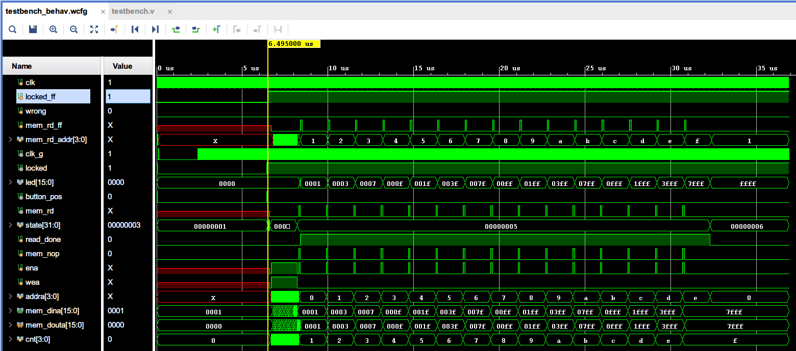
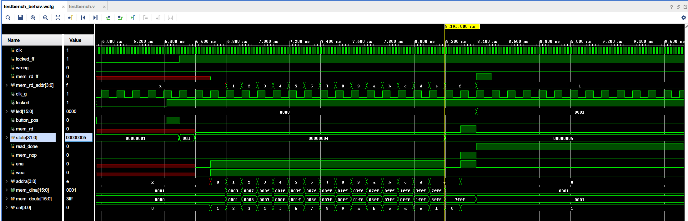
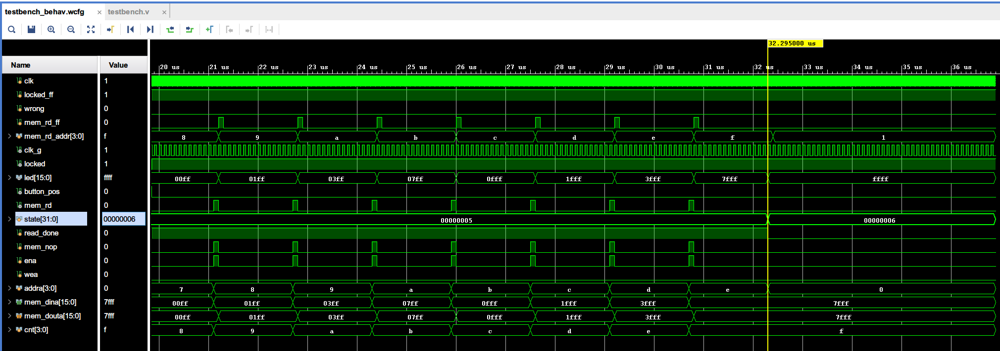

## 实验3波形分析

> 梁鑫嵘；200110619

[toc]

### 波形分析



系统状态分析：

1. 0~6.495us：

   1. 系统启动状态，等待时钟ip复位
   2. 系统复位状态，设置所有寄存器的初值

2. 6.495~6.595us：等待按键状态，等待按下按钮后开始启动系统

3. 6.595~8.195us：写入BRAM状态

   

   1. `ena`、`wea`拉高表示写入BRAM
   2. `dina`和`addra`在当前周期表示当前周期应该写入的数据
   3. `cnt`达到`0xF`之后写入完成

4. 8.195~32.195us：读取BRAM到`led`显示状态

   

   1. 读取时`ena`拉高而`wea`置低，表示读取BRAM
   2. 读取后在下一周期把读取到的数据`douta`同步到`led`输出
   3. 每次读取间隔15个周期（实际上板调整为`10000000`个周期）

5. 32.195us~FOREVER：显示完成状态，等待按键后回到初始化状态

### 附：程序

`memory_top.v`

```verilog
module memory_top (
  input  wire        clk   ,
	input  wire        rst   ,
	input  wire        button,
	output wire [15:0] led   
);

	wire locked;
	wire clk_g;

	wire [15:0] mem_dina;
	wire [3:0] mem_addra;
	wire [15:0] mem_douta;
	wire mem_wea;
	wire mem_ena;

	clk_div u_clk_div (
		.clk_in1(clk),
		.clk_out1(clk_g),
		.locked(locked)
	);

	memory_w_r u_memory_w_r (
		.clk_g(clk_g),
		.rst(rst),
		.button(button),
		.led(led),
		.locked(locked),
		.mem_ena(mem_ena),
		.mem_wea(mem_wea),
		.mem_addra(mem_addra),
		.mem_dina(mem_dina),
		.mem_douta(mem_douta)
	);

	led_mem u_led_mem (
		.clka(clk_g),
		.ena(mem_ena),
		.wea(mem_wea),
		.addra(mem_addra),
		.dina(mem_dina),
		.douta(mem_douta)
	);

endmodule
```

`memory_w_r.v`

```verilog
`timescale 1ns / 1ps
//////////////////////////////////////////////////////////////////////////////////
// Company: 
// Engineer: 
// 
// Create Date: 2021/11/15 23:03:17
// Design Name: 
// Module Name: memory_w_r
// Project Name: 
// Target Devices: 
// Tool Versions: 
// Description: 
// 
// Dependencies: 
// 
// Revision:
// Revision 0.01 - File Created
// Additional Comments:
// 
//////////////////////////////////////////////////////////////////////////////////


module memory_w_r(
    input wire clk_g,
    input wire rst,
    input wire button,
    output wire [15:0] led,
    output wire locked,
    output wire mem_ena,
    output wire mem_wea,
    output wire [3:0] mem_addra,
    output wire [15:0] mem_dina,
    input wire [15:0] mem_douta
);
  parameter STATE_RESET = 1;
  parameter STATE_NOT_WORK = 2;
  // 这个状态是等待按键松开
  parameter STATE_NOT_WORK_2 = 3;
  parameter STATE_WRITE = 4;
  parameter STATE_READ = 5;
  parameter STATE_DONE = 6;
  parameter delay = 32'd15;
  // parameter delay = 32'd20000000;
  integer state;
  reg [31:0] tim;
  reg [3:0] cnt;

  reg read_done;
  assign led = (state == STATE_READ && read_done) ? mem_douta : (state == STATE_DONE ? 16'hFFFF : 16'd0);

  reg [15:0] data [15:0];

  reg ena;
  reg wea;
  reg [3:0] addra;

  assign mem_ena = ena;
  assign mem_wea = wea;
  assign mem_addra = addra;
  // 防止为了给data[cnt]求值造成再延迟一个周期，还是assign吧
  assign mem_dina = data[cnt];

  // 读取需要等待到下一周期才取，即 WriteFirst
  reg mem_nop;

  always @ (posedge clk_g or posedge rst) begin
    if (rst) begin
      tim <= 32'b0;
      // 实际上data[0]不会被用到
      data[0]  <= 16'h0001;
      data[1]  <= 16'h0001;
      data[2]  <= 16'h0003;
      data[3]  <= 16'h0007;
      data[4]  <= 16'h000F;
      data[5]  <= 16'h001F;
      data[6]  <= 16'h003F;
      data[7]  <= 16'h007F;
      data[8]  <= 16'h00FF;
      data[9]  <= 16'h01FF;
      data[10] <= 16'h03FF;
      data[11] <= 16'h07FF;
      data[12] <= 16'h0FFF;
      data[13] <= 16'h1FFF;
      data[14] <= 16'h3FFF;
      data[15] <= 16'h7FFF;
      state <= STATE_RESET;
      cnt <= 4'b0;
      mem_nop <= 1'b0;
      read_done <= 1'b0;
    end
    else begin
      if (locked) begin
        if (state == STATE_RESET) begin
          if (button) state <= STATE_NOT_WORK_2;
          else state <= STATE_NOT_WORK;
        end
        else if (state == STATE_NOT_WORK) begin
          if (button) state <= STATE_NOT_WORK_2;
        end
        else if (state == STATE_NOT_WORK_2) begin
          if (~button) begin
            state <= STATE_WRITE;
            tim <= 32'b0;
            cnt <= 4'b0;
            mem_nop <= 1'b0;
            ena <= 1'b0;
            wea <= 1'b0;
          end
        end
        else if (state == STATE_WRITE) begin
          if (cnt == 4'd15) begin
            state <= STATE_READ;
            cnt <= 4'b0;
            ena <= 1'b0;
            wea <= 1'b0;
          end
          else begin
            ena <= 1'b1;
            wea <= 1'b1;
            addra <= cnt;
            // 本周期结束之后 cnt == 1，所以是直接从data[1]开始写入的，
            // mem(i) 对应data[i+1]，一直写入到data[15]
            cnt <= cnt + 4'b1;
          end
        end
        else if (state == STATE_READ) begin
          if (mem_nop) begin
            mem_nop <= 1'b0;
            ena <= 1'b0;
            wea <= 1'b0;
            read_done <= 1'b1;
          end
          else begin
            if (tim == 32'b0) begin
              // -1 是因为有一个周期在等待读取结果
              tim <= delay - 1;
              ena <= 1'b1;
              wea <= 1'b0;
              addra <= cnt;
              if (cnt == 4'd15) begin
                mem_nop <= 1'b0;
                state <= STATE_DONE;
                ena <= 1'b0;
                wea <= 1'b0;
                addra <= 4'b0;
                read_done <= 1'b0;
              end
              else begin
                mem_nop <= 1'b1;
                cnt <= cnt + 4'b1;
              end
            end
            else begin
              tim <= tim - 32'b1;
            end
          end
        end
        else if (state == STATE_DONE) begin
          if (button) state <= STATE_RESET;
        end
      end
    end
  end
endmodule
```

