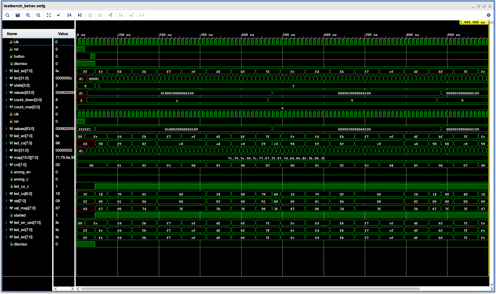

# 实验4仿真波形分析

波形图：（前1000ns）



## 模块化设计

本实验的代码使用了两个模块（`module`）：`led_display`和`led_display_ctrl`，分别负责闪烁显示`values`寄存器的值和更新`values`寄存器。

### `led_display`模块

本模块部分波形如下：


`tim`每个时钟周期自增1，到`delay`的下一周期回到0；`cnt`是当`tim`回到0的那一个周期自增1，并且当`cnt`到7之后下一个周期变成0。`cnt`表示`lde_display`将要显示的数码管位位置，`val`为当前数码管的值，`val_map`为当前数码管设置的亮灯位置，`led_cx`为`~val_map`。

### `led_display_ctrl`模块

本模块负责按照规则更新`values`。

部分波形如下：


**模块内状态机设计：**

1. `STATE_RESET`：初始化状态，此状态初始化各寄存器的值，设定系统初始状态。
2. `STATE_RESET_STOP`：初始化完成状态，此状态用来等待按键抬起，开始显示。
3. `STATE_RUNNING`：此为显示状态。

本模块将会给`values`赋初值，并且在开始运行后在规定的时间后更新`values`倒计时对应位置的数字。

## 附录：全部代码

```verilog
// Author: Chiro. LICENSE: GPL v3
// led_display模块，负责闪烁显示 values中的值
module led_display #(
	parameter delay = 5
) (
	input 	wire clk,
	input	wire rst,
	input	wire [63:0] values,
	output	wire [7:0] led_en,
	output	wire [7:0] led_cx
);
	reg [31:0] tim;
	reg [7:0] cnt;

	// 负责把values[i:i+8]的值转换到数码管显示
	reg [7:0] map [15:0];

	// 当前需要显示的数码管的值
	wire [7:0] val;
	// 当前需要显示的数码管对应灯
	wire [7:0] val_map;

	assign led_en = rst ? 8'b0 : ~(1 << cnt);
	// Verilog不允许取段的两边都为变量，需要用这种方式取某一段
	//								(cnt*8):(cnt*8+8)
	assign val = values[(cnt<<3)+:8];
	assign val_map = map[val];

	// 因为是低触发所以取个反；直接assign就减少了一次寄存器操作
	assign led_cx = ~val_map;

	always @ (posedge clk or posedge rst) begin
		if (rst) begin
			// 初始化寄存器
			cnt <= 8'b0;
			tim <= 32'b0;
			// 初始化转换数据
			//					   pgfedcba
			map[8'h0] = 8'b00111111;
			map[8'h1] = 8'b00000110;
			map[8'h2] = 8'b01011011;
			map[8'h3] = 8'b01001111;
			//					   pgfedcba
			map[8'h4] = 8'b01100110;
			map[8'h5] = 8'b01101101;
			map[8'h6] = 8'b01111101;
			map[8'h7] = 8'b00000111;
			//					   pgfedcba
			map[8'h8] = 8'b01111111;
			map[8'h9] = 8'b01100111;
			map[8'ha] = 8'b01110111;
			map[8'hb] = 8'b01111100;
			//					   pgfedcba
			map[8'hc] = 8'b01011000;
			map[8'hd] = 8'b01011110;
			map[8'he] = 8'b01111001;
			map[8'hf] = 8'b01110001;
		end
		else begin
			// tim: [0...delay]
			if (tim == delay) begin
				tim <= 32'b0;
				// cnt: [0...7]
				if (cnt == 8'd7) begin
					cnt <= 8'b0;
				end
				else begin
					cnt <= cnt + 8'b1;
				end
			end
			else begin
				tim <= tim + 32'b1;
			end
		end
	end
endmodule


// led_display_ctrl模块，负责按照规则更新values
module led_display_ctrl (
	input  wire       clk   ,
	input  wire       rst   ,
	input  wire       button,
	output wire [7:0] led_en,
	output wire       led_ca,
	output wire       led_cb,
	output wire       led_cc,
	output wire       led_cd,
	output wire       led_ce,
	output wire       led_cf,
	output wire       led_cg,
	output wire       led_dp 
);
	// 显示一个数码管位的分频数
	// parameter delay_flash = 50000;
	parameter delay_flash = 5;
	// 倒计时数据更新的分频数
	// parameter delay_update = 100000000;
	// parameter delay_update = 10000;
	// parameter delay_update = 100;
	parameter delay_update = 40;
	parameter count_max = 4'd10;
	reg [31:0] tim;

	reg [3:0] state;
	parameter STATE_RESET = 0;
	parameter STATE_RESET_STOP = 1;
	parameter STATE_RUNNING = 2;

	// 需要显示的信息
	parameter disp_info = 24'h200619;
	// 需要显示的数据（初始化的值）
	// 我用的是8bit/数码管，所以中间添加0
	// parameter disp_data = 64'h0100_0200_0006_0109;
	parameter disp_data = {16'h0100, 
		4'h0, disp_info[(5<<2)+:4],
		4'h0, disp_info[(4<<2)+:4],
		4'h0, disp_info[(3<<2)+:4],
		4'h0, disp_info[(2<<2)+:4],
		4'h0, disp_info[(1<<2)+:4],
		4'h0, disp_info[(0<<2)+:4]
	};

	reg [63:0] values;
	reg [3:0] count_down;

	reg started;

	wire [7:0] led_cx;
	wire [7:0] led_en_use;
	// 表示现在数码管不显示
	wire dismiss;
	assign dismiss = (rst || (~started) || button);
	assign led_en = dismiss ? (~8'd0) : led_en_use;
	// 把需要输出的信号都绑定到 led_cx，方便对应到 values
	assign {led_dp, led_cg, led_cf, led_ce, led_cd, led_cc, led_cb, led_ca} = dismiss ? (~8'd0) : led_cx;
	led_display led_display_u (
		.clk(clk),
		.rst(rst),
		// 按键的时候全灭
		.values(dismiss ? (~64'h0) : values),
		// .led_en(led_en),
		.led_en(led_en_use),
		.led_cx(led_cx)
	);

	// 设置模块内的参数
	defparam led_display_u.delay = delay_flash;

	always @ (posedge clk or posedge rst) begin
		if (rst) begin
			state <= STATE_RESET;
			started <= 1'b0;
		end
		else begin
			if (state == STATE_RESET) begin
				values <= disp_data;
				// 初始化显示倒计时
				count_down <= count_max;
				tim <= 32'b0;
				if (button || started) begin
					state <= STATE_RESET_STOP;
					started <= 1'b1;
				end
			end
			else if (state == STATE_RESET_STOP) begin
				if (~button) begin
					state <= STATE_RUNNING;
				end
			end
			else if (state == STATE_RUNNING) begin
				if (button) begin
					state <= STATE_RESET;
				end
				if (tim == delay_update) begin
					tim <= 32'b0;
					if (count_down == 4'b0) begin
						count_down <= count_max;
					end
					else begin
						count_down <= count_down - 4'b1;
					end
				end
				else begin
					tim <= tim + 32'b1;
					// 更新values即更新显示的值
					// 这里只支持到10
					values[(7<<3)+:8] <= {4'b0, count_down > (count_max - 1) ? 4'h1 : 4'h0};
					values[(6<<3)+:8] <= {4'b0, count_down > (count_max - 1) ? (count_down - 4'd10) : count_down};
				end
			end
		end
	end

endmodule
```

