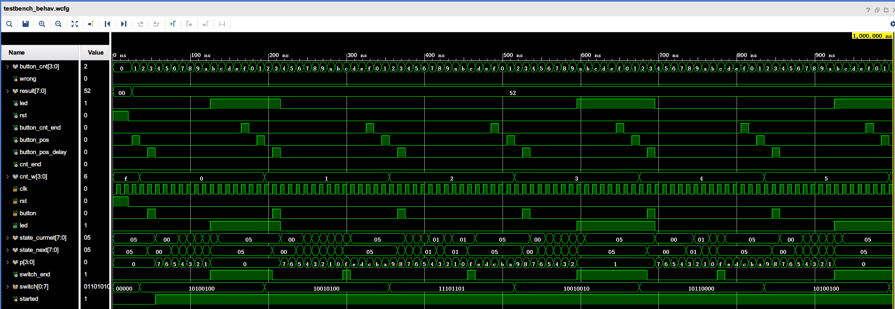

#  实验5波形分析

观察状态转移图可知：

1. `state_next`表示即将跳转的下一状态，`state_current`表示当前状态。到下一时钟周期，`state_current`将会变成上一周期的`state_next`的值。
2. `state_current`状态转移遵循了状态转移图。
3. 每次按下`button`，`p`将会从`7`递减到`0`，`switch[p]`代表状态图中的`switch`。